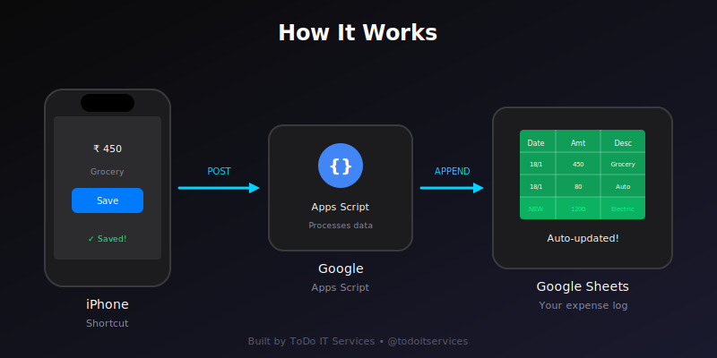
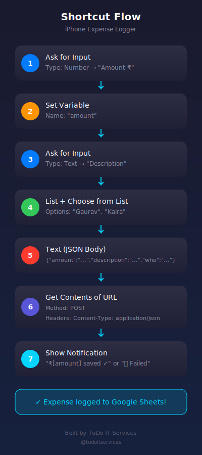
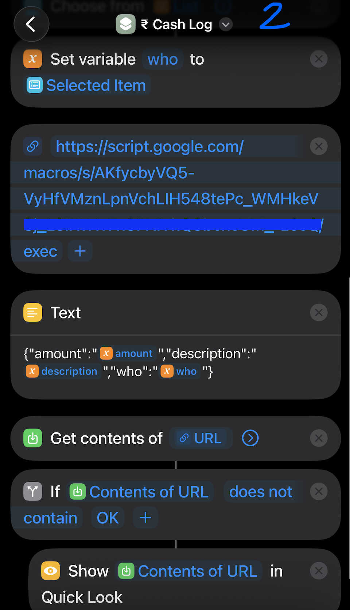
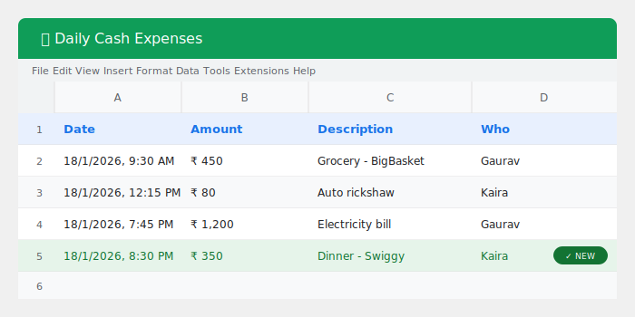

# 📱 iPhone Expense Logger

A simple, free expense tracking system using **iPhone Shortcuts + Google Sheets**. Log expenses in under 5 seconds — no app needed.

Perfect for couples, families, or solo use.

  

---

## 🎬 Demo

https://github.com/todoitservices/expense-logger/assets/Cash%20Logger%20Reel%20ToDo%20IT.mp4

<!-- 
NOTE: After pushing to GitHub, replace the above with the actual video embed.
Steps:
1. Go to README.md on GitHub
2. Click Edit (pencil icon)
3. Delete the line above
4. Drag your video file from assets/ folder into the editor
5. GitHub will auto-generate the embed code
6. Commit changes
-->

---

## ✨ Features

- **One-tap logging** — Amount, description, who paid
- **Auto-sync** — Instantly updates Google Sheets
- **Two-person support** — Track expenses for couples/families
- **Free forever** — No subscriptions, no apps to install
- **Offline capable** — Queues and syncs when online
- **5 seconds** — Faster than any expense app

---

## 🔄 How It Works



```
iPhone Shortcut → Google Apps Script → Google Sheet
```

1. Tap shortcut on home screen
2. Enter amount & description
3. Select who paid
4. Done! Data syncs to Google Sheets instantly.

---

## 📋 What You'll Need

- iPhone (iOS 15+)
- Google Account (for Sheets)
- 15-20 minutes for setup

---

## 🚀 Setup Guide

### Step 1: Create Google Sheet

1. Go to [sheets.google.com](https://sheets.google.com)
2. Create new spreadsheet
3. Name it: `Daily Expenses`
4. Add headers in Row 1:

| A | B | C | D |
|---|---|---|---|
| Date | Amount | Description | Who |

5. Copy the **Sheet ID** from the URL:
```
https://docs.google.com/spreadsheets/d/SHEET_ID_HERE/edit
```

---

### Step 2: Add Google Apps Script

1. Go to [script.google.com](https://script.google.com)
2. Click **New Project**
3. Name it: `Expense Logger`
4. Delete existing code and paste the code from [`apps-script/code.js`](apps-script/code.js)

Or copy this:

```javascript
function doPost(e) {
  // Replace with YOUR Sheet ID
  const SHEET_ID = 'YOUR_SHEET_ID_HERE';
  
  const sheet = SpreadsheetApp.openById(SHEET_ID).getActiveSheet();
  const data = JSON.parse(e.postData.contents);
  
  sheet.appendRow([
    new Date().toLocaleString('en-IN', {timeZone: 'Asia/Kolkata'}),
    data.amount,
    data.description,
    data.who
  ]);
  
  return ContentService.createTextOutput('OK');
}
```

5. Replace `YOUR_SHEET_ID_HERE` with your actual Sheet ID
6. Click **Deploy** → **New deployment**
7. Settings:
   - Type: **Web app**
   - Execute as: **Me**
   - Who has access: **Anyone**
8. Click **Deploy**
9. **Authorize** when prompted (click Advanced → Go to Expense Logger)
10. Copy the **Web app URL**

---

### Step 3: Create iPhone Shortcut

Open the **Shortcuts** app and create a new shortcut with these actions:



<details>
<summary>📱 Click to expand detailed steps</summary>

#### Action 1: Ask for Input
- Type: **Number**
- Prompt: `Amount ₹`

#### Action 2: Set Variable
- Name: `amount`
- Value: *[Ask for Input result]*

#### Action 3: Ask for Input
- Type: **Text**
- Prompt: `Description`

#### Action 4: Set Variable
- Name: `description`
- Value: *[Ask for Input result]*

#### Action 5: List
- Add items: `Your Name`, `Partner Name`

#### Action 6: Choose from List

#### Action 7: Set Variable
- Name: `who`
- Value: *[Chosen Item]*

#### Action 8: Text
```
{"amount":"[amount]","description":"[description]","who":"[who]"}
```
*(Insert variables where shown — no spaces around them)*

#### Action 9: Get Contents of URL
- URL: *[Your Web App URL from Step 2]*
- Method: **POST**
- Headers: `Content-Type` = `application/json`
- Request Body: **File**
- File: *[Text from Action 8]*

#### Action 10: If
- Condition: *[Contents of URL]* **contains** `OK`
- Then: **Show Notification** → `₹[amount] saved ✓`
- Otherwise: **Show Notification** → `❌ Failed - Try again`

</details>

**Real Screenshots:**

| Step 1 | Step 2 |
|--------|--------|
|  |  |

---

### Step 4: Add to Home Screen

1. Long press the shortcut
2. Tap **Share** → **Add to Home Screen**
3. Name it: `₹ Log` or `Expense`
4. Choose an icon
5. Done! 🎉

---

## 📊 Google Sheet Example



Your expenses will automatically appear like this:

| Date | Amount | Description | Who |
|------|--------|-------------|-----|
| 18/1/2026, 9:30 AM | ₹ 450 | Grocery - BigBasket | Gaurav |
| 18/1/2026, 12:15 PM | ₹ 80 | Auto rickshaw | Kaira |
| 18/1/2026, 7:45 PM | ₹ 1,200 | Electricity bill | Gaurav |

---

## 👫 Setup for Partner/Family

1. Share the shortcut via AirDrop or iMessage
2. They edit the **List** action — put their name first
3. Use the **same Web App URL**
4. Both log to the same Google Sheet

---

## 🛠️ Troubleshooting

<details>
<summary>❌ "Script function not found: doPost"</summary>

Create a **new deployment** and update the URL in your shortcut.
</details>

<details>
<summary>❌ "400 Bad Request"</summary>

Wait 5 minutes (Google rate limit), then create new deployment with fresh URL.
</details>

<details>
<summary>❌ Data in wrong columns</summary>

Check JSON text block — no spaces around variables.
Should be: `{"amount":"[amount]"...}` not `{"amount":" [amount] "...}`
</details>

<details>
<summary>❌ Google sign-in page appears</summary>

Redeploy with **"Who has access: Anyone"** (not "Anyone with Google account")
</details>

---

## 📁 Repository Structure

```
expense-logger/
├── README.md                 ← You are here
├── LICENSE                   ← MIT License
├── apps-script/
│   └── code.js              ← Google Apps Script code
├── assets/
│   └── Cash Logger Reel ToDo IT.mp4   ← Demo video
└── screenshots/
    ├── architecture-flow.svg          ← How it works diagram
    ├── shortcut-flow-diagram.svg      ← Shortcut steps diagram
    ├── sheet-example.svg              ← Sheet mockup
    ├── screenshot_flow_1.png          ← Real iPhone screenshot
    └── screenshot_flow_2.png          ← Real iPhone screenshot
```

---

## 🔮 Future Enhancements

- [ ] Add expense categories
- [ ] Receipt photo attachment
- [ ] Monthly summary automation
- [ ] Budget alerts
- [ ] Siri voice integration

---

## 🤝 Contributing

Found a bug or have an improvement? PRs welcome!

---

## 📄 License

MIT License — use it however you want.

---

## 🏢 Built By

**[ToDo IT Services](https://instagram.com/todoitservices)**

We build smart automations for businesses.

📩 DM us for custom automation solutions!

---

## ⭐ Support

If this helped you, please:
- ⭐ Star this repo
- 📤 Share with someone who needs it
- 📱 Follow [@todoitservices](https://instagram.com/todoitservices) for more

---

*Made with ❤️ in Ahmedabad, India*
